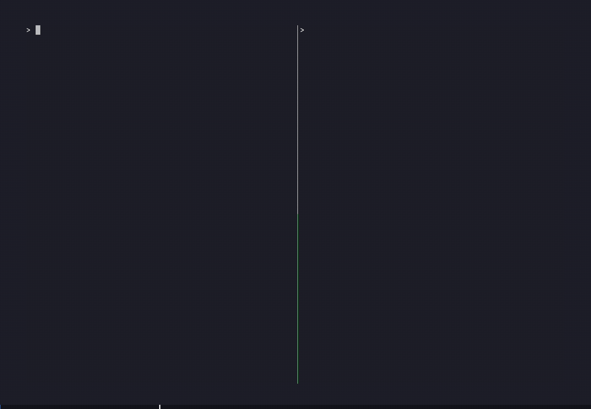

<div align="center">


# instancez

**An LLM-friendly, single-binary, drop-in replacement to Supabase.**

Defined in one YAML file — self-hosted in seconds.

[](https://github.com/instancez/instancez/actions/workflows/ci.yml)
[](https://github.com/instancez/instancez/releases)
[](LICENSE)

[Quick start](#quick-start) · [Docs](https://instancez.github.io) · [Feature parity](#feature-parity)

</div>

## Why instancez?

- **One YAML file is the schema.** Edit `instancez.yaml` and instancez diffs it against the live database, applying just the delta migration (including drops) — no migration files to write or run by hand.
- **Compatible with Supabase clients** (`@supabase/supabase-js`, and others). Point your existing client at instancez and it works: auth, PostgREST-style REST, RPC, storage.
- **Runs anywhere.** One self-contained, portable binary — locally, in Docker, on a VM, or on AWS Lambda.
- **LLM-friendly.** A simple, easy-to-understand YAML schema — tables, RLS, storage, RPC, functions — one file an LLM (or teammate) can read end to end.

<p align="center">
  <br>
  <sub><em><code>instancez.yaml</code> and <code>inz dev</code> booting, then a live supabase-js app: anonymous sign-in, then insert / update / delete.</em></sub>
</p>

<p align="center">
  <br>
  <sub><em>The built-in dashboard at <code>/dashboard</code>. Under <code>inz dev</code>, schema edits write back to <code>instancez.yaml</code> as a diff you review before it applies.</em></sub>
</p>

---

## Quick start

```bash
# macOS / Linux
curl -fsSL https://get.instancez.ai | sh

# Windows (PowerShell):
irm https://get.instancez.ai/windows | iex
```

Or build from source. This needs Go 1.25+ and Node 22+. The dashboard is embedded into the binary, so build it before the Go install:

```bash
(cd dashboard && npm ci && npm run build) && go install ./cmd/inz
```

```bash
mkdir my-app && cd my-app
inz init
inz dev --embedded-pg   # no Postgres to install; or drop the flag and set INSTANCEZ_DATABASE_URL to use your own

# you can run the following command or watch the output of the previous command for your secret key and publishable key
cat .development.env    # in a separate terminal — publishable + secret keys, generated on first run
```

`inz dev` provisions the Postgres roles, applies the schema, and serves the API at `http://localhost:8080`. Editing `instancez.yaml` re-applies the schema automatically.

## What's in the YAML?

Here's the whole app `inz init` scaffolds (`instancez.yaml`, comments trimmed):

```yaml
version: 1

project:
  name: "my-app"

providers:
  storage:
    type: local

auth:
  jwt_expiry: 15m
  refresh_tokens: true
  refresh_token_expiry: 7d
  email:
    verify_email: false

tables:
  todos:
    fields:
      - name: id
        type: bigserial
        primary_key: true
      - name: user_id
        foreign_key:
          references: auth.users.id
          on_delete: cascade
      - name: title
        type: text
        required: true
      - name: status
        type: text
        required: true
        enum: [pending, active, done]
        default: pending
      - name: created_at
        type: timestamptz
        required: true
        default: now()
    rls:
      - operations: [select, insert, update, delete]
        using: "user_id = auth.uid()"
        with_check: "user_id = auth.uid()"

storage:
  avatars:
    public: true
    max_size: 5MB
    types: [image/*]
    rls:
      - operations: [insert]
        with_check: "auth.is_authenticated()"
      - operations: [update]
        using: "auth.is_authenticated()"
        with_check: "auth.is_authenticated()"
      - operations: [delete]
        using: "auth.is_authenticated()"

functions:
  todos:
    runtime: node
    file: functions/todos.js
    auth_required: true
```

Query it with `supabase-js`:

```js
import { createClient } from '@supabase/supabase-js'

const supabase = createClient('http://localhost:8080', process.env.INSTANCEZ_PUBLISHABLE_KEY)

const { data, error } = await supabase
  .from('todos')
  .select('*')
```

Or with `curl`:

```bash
curl 'http://localhost:8080/rest/v1/todos?select=*' \
  -H "apikey: $INSTANCEZ_PUBLISHABLE_KEY"
```

The scaffolded `todos` table has a `user_id = auth.uid()` RLS policy, so rows are scoped to the signed-in user. To read without signing in while you experiment, set `using: "true"` on the policy in `instancez.yaml`.

## Coding agents

The repo ships an [agent skill](skills/instancez/SKILL.md) that teaches your coding agent the YAML syntax, RLS patterns, and the `inz` CLI. Install it into your project with the [skills CLI](https://github.com/vercel-labs/skills), which supports Claude Code, Codex, Cursor, OpenCode, Gemini CLI, Copilot, and more:

```bash
npx skills add instancez/instancez                  # auto-detects your agents
npx skills add instancez/instancez -a codex         # or target one explicitly
```

Claude Code users can install it as a plugin instead:

```
/plugin marketplace add instancez/instancez
/plugin install instancez@instancez
```

For any other agent, the skill is a single Markdown file: drop [`SKILL.md`](skills/instancez/SKILL.md) into your project and reference it from `AGENTS.md`. Details in the [Coding Agents docs](https://instancez.github.io/coding-agents/).

## Hosting and Deployment

**Self-host it yourself:**

```bash
inz serve
```

Secrets load automatically from `.production.env` if present, alongside the regular process environment.

**Or deploy to instancez Cloud:**

```bash
inz cloud deploy   # push instancez.yaml straight to a managed project
```

Self-hosting also runs on [Docker](https://instancez.github.io/deploy/docker/), [Kubernetes](https://instancez.github.io/deploy/kubernetes/), [AWS Lambda](https://instancez.github.io/deploy/lambda/), or a [bare VM](https://instancez.github.io/deploy/self-hosted/). [More on deployment →](https://instancez.github.io/deploy/docker/)

## Feature parity

| | instancez | Supabase |
| --- | --- | --- |
| Auth (password, magic link, OTP, anonymous, OAuth, TOTP MFA) | Yes (no phone/SMS) | Yes |
| PostgREST-style REST API | Yes | Yes |
| SQL functions (RPC) | Yes | Yes |
| JavaScript functions | Yes (Node.js) | Yes (Deno) |
| Storage (local or S3, RLS, signed URLs, image resize) | Yes (JPEG/PNG only, no WebP/AVIF) | Yes |
| Row-Level Security (RLS) | Yes | Yes |
| Realtime / websockets | Not supported yet | Yes |
| Schema definition | One declarative YAML file | SQL migrations + dashboard |
| Self-host footprint | One binary + Postgres | Multi-container stack |
| OAuth providers built in | Google, GitHub | Many |

## Examples

[`docs/examples/gearstore`](docs/examples/gearstore) is a full, runnable project: a React storefront talking to instancez over `@supabase/supabase-js`, exercising auth, RLS, and querying end to end. `docker compose up --build` gets you a working app with seeded data.

The docs also walk through two smaller builds start to finish: an [ecommerce store](https://instancez.github.io/examples/ecommerce-store/) with Stripe Checkout, and a [file gallery](https://instancez.github.io/examples/file-gallery/) with direct-to-S3 uploads.

## Documentation

Full docs live at **[instancez.github.io](https://instancez.github.io)**:

- [Quick start](https://instancez.github.io/quick-start/)
- [Tables and schema](https://instancez.github.io/build/schema/)
- [Auth](https://instancez.github.io/build/auth/)
- [RLS policies](https://instancez.github.io/build/rls/)
- [Querying](https://instancez.github.io/build/querying/)
- [Supabase SDK compatibility](https://instancez.github.io/supabase-compatibility/)
- [Deploy](https://instancez.github.io/deploy/docker/)

## Contributing

Contributions are welcome. Start with [CONTRIBUTING.md](CONTRIBUTING.md) for the dev setup, the test loop, and how the codebase is laid out. Bug reports and feature requests go through the [issue templates](.github/ISSUE_TEMPLATE).

## Security

Found a vulnerability? Please follow the private disclosure process in [SECURITY.md](SECURITY.md) rather than opening a public issue.

## License

Apache License 2.0, see [LICENSE](LICENSE). Contributions are covered by the [Contributor License Agreement](CLA.md).
